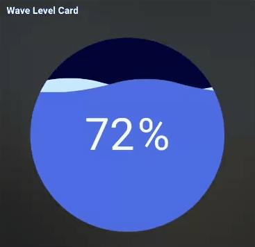

# wave-level-card
A custom Lovelace card for Home Assistant that displays a beautiful animated wave-style level indicator.   Perfect for sensors like soil moisture, water tanks, humidity, or any percentage-based entity.

# 🌊 Wave Level Card for Home Assistant

A **custom Lovelace card** for [Home Assistant](https://www.home-assistant.io/) that visualizes sensor values with an animated **wave-style level indicator** inside a circle.  
Useful for entities that represent percentage values such as **soil moisture, water tank levels, humidity, battery, etc.**



---

## ✨ Features

- 🎨 Beautiful animated water wave
- 🔢 Supports **any percentage-based entity**
- ⚙️ Configurable **min/max range**
- 📏 Adjustable **circle size**
- 🎨 Customizable colors (background, wave, crest, text)
- 🖥️ Works on mobile & desktop (no iframe needed)

---

## 📦 Installation

1. **Download** the file  
   Save [`wave-level-card.js`](./wave-level-card.js) into your Home Assistant `www` folder:


2. **Add as a Resource**  
Go to Home Assistant UI → *Settings* → *Dashboards* → *Resources* → *+ Add Resource*

- URL: `/local/wave-level-card.js`
- Type: **JavaScript Module**

> ⚠️ If you don’t see "Resources", enable **Advanced Mode** in your user profile.

3. **Clear cache / reload resources**  
Press `CTRL+F5` (browser) or reload from HA → *Developer Tools* → *Restart frontend*.

---
📷 Example

## 🛠️ Usage

Add the card to your dashboard using YAML:

```yaml
type: custom:wave-level-card
entity: sensor.d1waterpumb_soil_moisture_wemos
name: Soil Moisture
min: 0
max: 100
size: 280   # diameter of the circle in pixels

# Optional colors
fg: "#4d6de3"     # wave color
crest: "#c7eeff"  # crest wave color
bg: "#020438"     # background circle color
text: "#ffffff"   # text color
